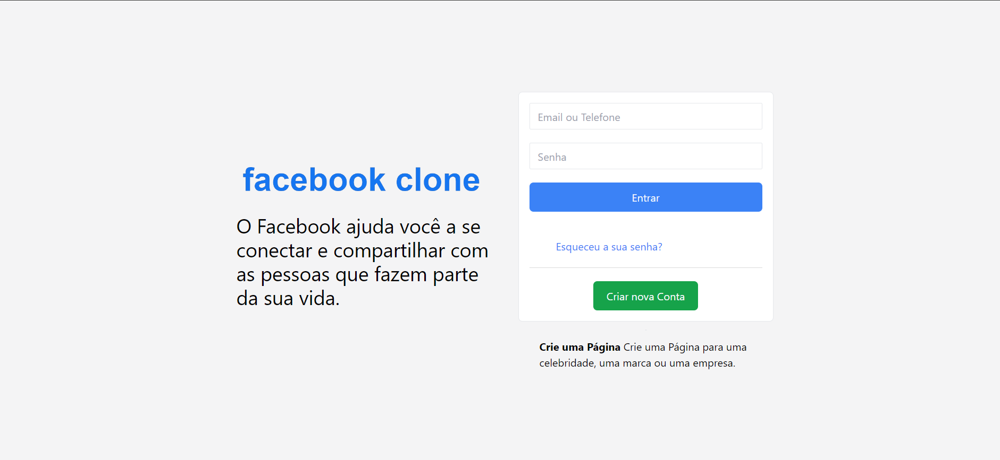
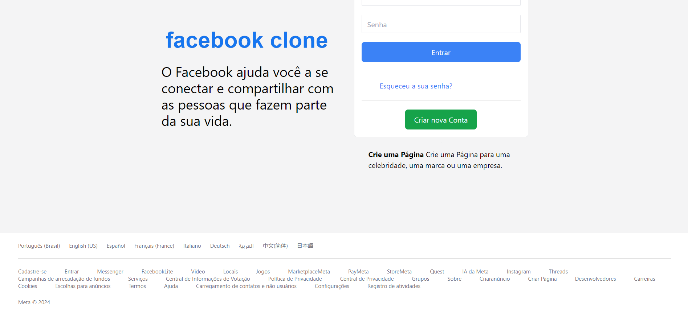

# Facebook clone

## Olá sejam bem-vindo

Projeto Facebook Clone: Desafio Tailwind CSS

Desenvolvendo com Tailwind CSS e buscando aprimorar minhas habilidades, embarquei em um projeto empolgante: a criação de um clone do Facebook!

Inspirado pelo vídeo do meu mentor, Rodolfo, mergulhei no universo do Tailwind CSS para construir a interface principal da plataforma. Foi uma jornada de aprendizado e superação, onde cada linha de código me aproximou do meu objetivo.

## Detalhes do Projeto:
- Tecnologia: Tailwind CSS
- Inspiração: Vídeo do meu mentor 
> https://www.youtube.com/watch?v=SUavcwCCLN8&t=2115s&ab_channel=DevClub%7CPrograma%C3%A7%C3%A3o
- Objetivo: Praticar Tailwind CSS e aprimorar habilidades de desenvolvimento


## Desafios e Aprendizados:
- Reproduzir a interface do Facebook com fidelidade, utilizando apenas Tailwind CSS, foi um desafio estimulante.
- A curva de aprendizado do Tailwind CSS foi íngreme, mas gratificante.
- A experiência me ensinou a importância da persistência, do planejamento e da busca por soluções criativas.

### Link:

> Portfólio: https://daliosy.github.io/my-PORTFOLIO

> Linkedin: https://www.linkedin.com/in/dalio-s-yamada/

#tailwindcss #facebookclone #desafio #aprendizado #homenagem #mentor #desenvolvedorweb

## Imagens:

<div align="center"> 
  
  
</div>

## Instrução de instalação
### 1. Clone o repositório com o comando:
```bash
git clone https://github.com/DalioSY/facebook-clone
```

### 2. Instale npm

```bash
npm i
```
### 3. Execute 

>src/index.html

Open with live server 
